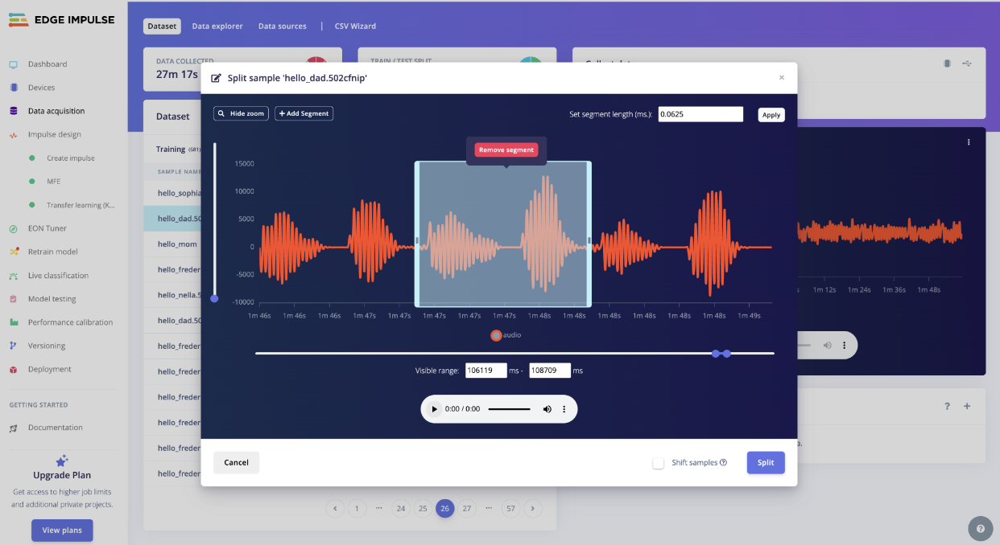

# Fitness Rehab Device

This Fitness Rehab Device is targeted toward people with shoulder injuries more specifically athletes and musicians such as guitarists. Using machine learning, the device can track correct shoulder movements for shoulder recovery. If the user performs the correct shoulder exercises for recovery, the device will be able to detect this and fill a progress bar.

<!--- Replace this text with a brief description (2-3 sentences) of your project. This description should draw the reader in and make them interested in what you've built. You can include what the biggest challenges, takeaways, and triumphs from completing the project were. As you complete your portfolio, remember your audience is less familiar than you are with all that your project entails! -->

<!---
<!---
You should comment out all portions of your portfolio that you have not completed yet, as well as any instructions:
```HTML 
<!--- This is an HTML comment in Markdown
<!--- Anything between these symbols will not render on the published site
```
-->


| **Engineer** | **School** | **Area of Interest** | **Grade** |
|:--:|:--:|:--:|:--:|
| Sophia C | Mountain View High School | Biomedical Engineering | Rising Junior


<!---
**Replace the BlueStamp logo below with an image of yourself and your completed project. Follow the guide [here](https://tomcam.github.io/least-github-pages/adding-images-github-pages-site.html) if you need help.**
-->

  
# Final Milestone

<!--- **Don't forget to replace the text below with the embedding for your milestone video. Go to Youtube, click Share -> Embed, and copy and paste the code to replace what's below.** -->

<!---
<iframe width="560" height="315" src="https://www.youtube.com/embed/F7M7imOVGug" title="YouTube video player" frameborder="0" allow="accelerometer; autoplay; clipboard-write; encrypted-media; gyroscope; picture-in-picture; web-share" allowfullscreen></iframe> 
-->

<!--- For your final milestone, explain the outcome of your project. Key details to include are:
- What you've accomplished since your previous milestone
- What your biggest challenges and triumphs were at BSE
- A summary of key topics you learned about
- What you hope to learn in the future after everything you've learned at BSE -->


# Second Milestone

<!--- **Don't forget to replace the text below with the embedding for your milestone video. Go to Youtube, click Share -> Embed, and copy and paste the code to replace what's below.** -->

<!---
<iframe width="560" height="315" src="https://www.youtube.com/embed/y3VAmNlER5Y" title="YouTube video player" frameborder="0" allow="accelerometer; autoplay; clipboard-write; encrypted-media; gyroscope; picture-in-picture; web-share" allowfullscreen></iframe>
-->

<!--- For your second milestone, explain what you've worked on since your previous milestone. You can highlight:
- Technical details of what you've accomplished and how they contribute to the final goal
- What has been surprising about the project so far
- Previous challenges you faced that you overcame
- What needs to be completed before your final milestone 

-->

# First Milestone

<iframe width="560" height="315" src="https://www.youtube.com/embed/7U8yNla3_gU?si=KJVs3y6t1QKK2BAB" title="YouTube video player" frameborder="0" allow="accelerometer; autoplay; clipboard-write; encrypted-media; gyroscope; picture-in-picture; web-share" referrerpolicy="strict-origin-when-cross-origin" allowfullscreen></iframe>

<br>

My main project is the Fitness Rehab device. This project requires using Edge Impulse to create a machine learning model. Edge Impulse is an online platform where users can create their own machine learning models. My first milestone was to get familiar with the Edge Impulse interface by completing one of the tutorials and gaining a deeper understanding of how machine learning works. One of the main parts of my project is machine learning. Therefore, being confident in my understanding and abilities to create a machine learning model is essential to my project.

The tutorial that I used was an audio classifier model. My final model had 7 classifiers: hello_dad, hello_frederick, hello_nella, hello_sophia, hello_mom, noise, and unknown. The model works by having the user say something into the microphone of a computer or phone. If the user says one of the hello classifiers, the classifier will show on the screen. It will also show how accurate the model's prediction is based on the data that it has. The ideal accuracy for a machine learning model such as this one is 80%. If the model isn't able to classify what the user is saying into one of the five hello classifiers then it will display “unknown” or “noise” as well as the accuracy.

One of the challenges that I had to overcome was data bias because of underfitting. When I first trained the model I only had three classes: hello_sophia, noise, and unknown. Since there weren't that many classifications I didn't need much data in order for the model to determine the relationship between the classifications. However, when I added the other four classifiers I encountered underfitting. Since I didn't have much data for the new hello classifiers and much more for hello_sophia, the model was unable to determine the relationships between the classifications. It would automatically default to hello_sophia because that is where I had most of my data. In order to overcome this challenge I had to record more data for my new classes. Not only did this help remove my data bias but it also improved my accuracy.

Something that I learned in this milestone was data splitting. When I was recording my data for my model I used recordings that were 1-3min long with me repeating the classifier over and over again. This led to a low accuracy because the model wasn’t able to determine specifically when I was saying the classifier. In order to overcome this challenge I split my recordings. Splitting into small manageable chunks on Edge Impulse helps organize each individual classification so that it has a train/test split of 80/20 respectfully. 

Overall, through doing this tutorial I learned a lot about machine learning and how to use Edge Impulse. I am excited to implement what I have learned into my Fitness Rehab device.


<be>
This is my Edge Impulse model. I said “hello frederick” into the microphone of my computer and the model responded by showing the hello_frederick classifier and an accuracy of 91%. 



<be>
This is how I split my data recording on Edge Impulse. This recording was originally 2min. I was able to split the data by zooming in on the individual waveforms. I added segments in order for Edge Impulse to understand specifically what parts of the audio I needed to split. After splitting the recording, I was able to turn this 2min recording into 1-2 sec data sets. 


<!---
**Don't forget to replace the text below with the embedding for your milestone video. Go to Youtube, click Share -> Embed, and copy and paste the code to replace what's below.** -->


<!---
<iframe width="560" height="315" src="https://www.youtube.com/embed/CaCazFBhYKs" title="YouTube video player" frameborder="0" allow="accelerometer; autoplay; clipboard-write; encrypted-media; gyroscope; picture-in-picture; web-share" allowfullscreen></iframe>
-->

<!--- For your first milestone, describe what your project is and how you plan to build it. You can include:
- An explanation about the different components of your project and how they will all integrate together
- Technical progress you've made so far
- Challenges you're facing and solving in your future milestones
- What your plan is to complete your project -->

# Schematics 
<!--- Here's where you'll put images of your schematics. [Tinkercad](https://www.tinkercad.com/blog/official-guide-to-tinkercad-circuits) and [Fritzing](https://fritzing.org/learning/) are both great resoruces to create professional schematic diagrams, though BSE recommends Tinkercad becuase it can be done easily and for free in the browser. -->

# Code
<!--- Here's where you'll put your code. The syntax below places it into a block of code. Follow the guide [here]([url](https://www.markdownguide.org/extended-syntax/)) to learn how to customize it to your project needs. -->
<!---
```c++
void setup() {
  // put your setup code here, to run once:
  Serial.begin(9600);
  Serial.println("Hello World!");
}

void loop() {
  // put your main code here, to run repeatedly:

}
```
-->
# Bill of Materials
<!--- Here's where you'll list the parts in your project. To add more rows, just copy and paste the example rows below.
Don't forget to place the link of where to buy each component inside the quotation marks in the corresponding row after href =. Follow the guide [here]([url](https://www.markdownguide.org/extended-syntax/)) to learn how to customize this to your project needs. -->
<!---
| **Part** | **Note** | **Price** | **Link** |
|:--:|:--:|:--:|:--:|
| Item Name | What the item is used for | $Price | <a href="https://www.amazon.com/Arduino-A000066-ARDUINO-UNO-R3/dp/B008GRTSV6/"> Link </a> |
| Item Name | What the item is used for | $Price | <a href="https://www.amazon.com/Arduino-A000066-ARDUINO-UNO-R3/dp/B008GRTSV6/"> Link </a> |
| Item Name | What the item is used for | $Price | <a href="https://www.amazon.com/Arduino-A000066-ARDUINO-UNO-R3/dp/B008GRTSV6/"> Link </a> |
-->
# Starter Project - Weevil Eyes

<iframe width="560" height="315" src="https://www.youtube.com/embed/GFcvl3yDpks?si=2sdZIt-8Nk4kHONy" title="YouTube video player" frameborder="0" allow="accelerometer; autoplay; clipboard-write; encrypted-media; gyroscope; picture-in-picture; web-share" referrerpolicy="strict-origin-when-cross-origin" allowfullscreen></iframe>
<br>
  I chose Weevil Eyes as my starter project because I wanted to gain a basic understanding of some of the fundamental electrical components used in electrical engineering. When pressing my finger on the photocell of my Weevil Eyes project, the light emitting diodes (LED’s) light up and when I remove my finger from the photocell the LED’s go dark. 
  
  The components of my Weevil Eyes are a Weevil Eye Circuit Board, 2 LED’s, a 47K resistor, two 220K resistors, a Bipolar Junction Transistor (BJT), a photocell, a battery holder, and a 20mm battery. A photocell is a light sensitive resistor: as light increases, the resistance decreases and vice versa. **Figure** shows that the voltage of the battery (3V) remains constant and the current depends on the resistance of the photocell (R4 in **Figure 1**). Basically R4 and R3 form a voltage divider which controls the voltage of the base. **Figure 2** shows the BJT.
  
  There are three BJT components: 1) collector, 2) base, and 3) emitter. The collector is connected to ground, the base is connected to the photocell, and the emitter is connected to the resistors and LEDs, all shown in **Figure 1**. The resistors restrict and regulate the electrical current. When your finger is removed from the photocell, there is resistance and the electrical current cannot pass through the collector and emitter. This means that the circuit is an open circuit and the LEDs won’t turn on.
 
  I am excited to begin my Fitness Rehab Device as my main project and strengthen my electrical engineering skill set.


<br>
Figure 1: Schematic showing Weevil Eye circuit. R4 is the photocell and is the only sensor. This controls the LED lights.
Source: https://www.youtube.com/watch?v=Az2TM6Gtp0o


<br>
Figure 2: Schematic that shows how the Bipolar Junction Transistor (BJT) in my Weevil Eye project.

<!---
# Other Resources/Examples
One of the best parts about Github is that you can view how other people set up their own work. Here are some past BSE portfolios that are awesome examples. You can view how they set up their portfolio, and you can view their index.md files to understand how they implemented different portfolio components.
- [Example 1](https://trashytuber.github.io/YimingJiaBlueStamp/)
- [Example 2](https://sviatil0.github.io/Sviatoslav_BSE/)
- [Example 3](https://arneshkumar.github.io/arneshbluestamp/)

To watch the BSE tutorial on how to create a portfolio, click here.
-->
