# Fitness Rehab Device

This Fitness Rehab Device is targeted toward people with shoulder injuries more specifically athletes and musicians such as guitarists. Using machine learning, the device can track correct shoulder movements for shoulder recovery. If the user performs the correct shoulder exercises for recovery, the device will be able to detect this and fill a progress bar.

<!--- Replace this text with a brief description (2-3 sentences) of your project. This description should draw the reader in and make them interested in what you've built. You can include what the biggest challenges, takeaways, and triumphs from completing the project were. As you complete your portfolio, remember your audience is less familiar than you are with all that your project entails! -->

<!---
<!---
You should comment out all portions of your portfolio that you have not completed yet, as well as any instructions:
```HTML 
<!--- This is an HTML comment in Markdown
<!--- Anything between these symbols will not render on the published site
```
-->


| **Engineer** | **School** | **Area of Interest** | **Grade** |
|:--:|:--:|:--:|:--:|
| Sophia C | Mountain View High School | Biomedical Engineering | Rising Junior

<!---
**Replace the BlueStamp logo below with an image of yourself and your completed project. Follow the guide [here](https://tomcam.github.io/least-github-pages/adding-images-github-pages-site.html) if you need help.**
-->

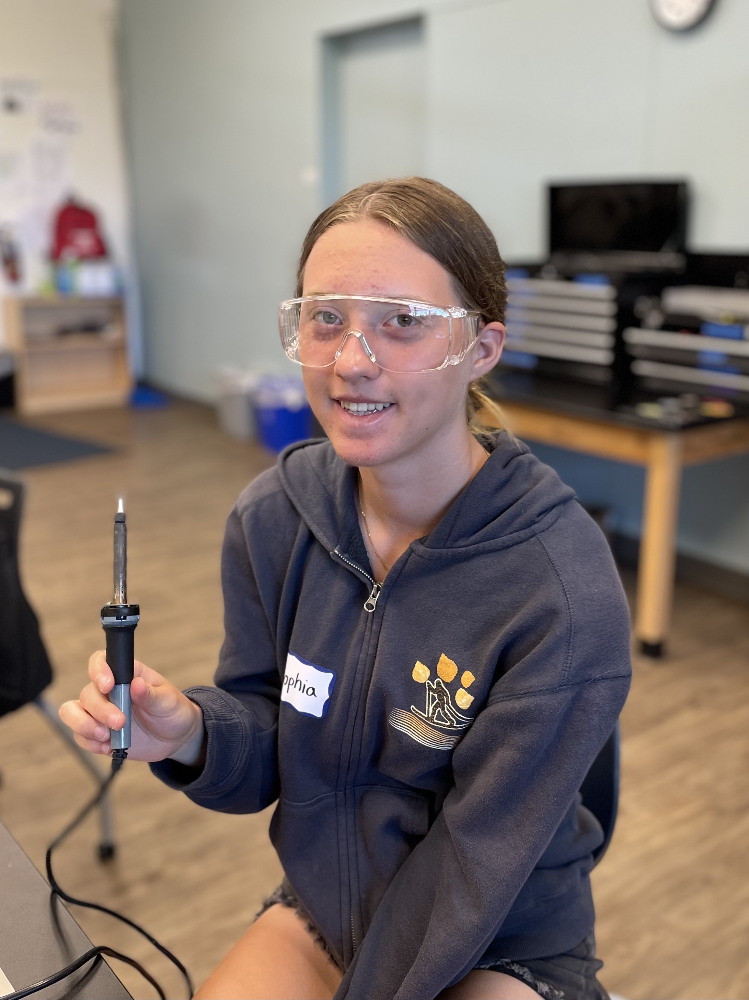
  
# Final Milestone

<iframe width="560" height="315" src="https://www.youtube.com/embed/kukRyGKWqIg?si=n8S5W3NMdumCRXMF" title="YouTube video player" frameborder="0" allow="accelerometer; autoplay; clipboard-write; encrypted-media; gyroscope; picture-in-picture; web-share" referrerpolicy="strict-origin-when-cross-origin" allowfullscreen></iframe>

<br>
&emsp; &emsp; This <a href="https://studio.edgeimpulse.com/studio/427768"> Link </a> is the link for my Edge Impulse Model. This will show all of the data that I used to train my Fitness Rehab Device Mode and my neural network classifiers. 
In order to complete my 3rd milestone I had to 3D print a custom box for all the components of my circuit and have the organic light-emitting diode display (OLED) screen show progress that the user is making based on my Edge Impulse model. This milestone was about finishing up any loose ends and making a final product.
<br>
&emsp; &emsp; **Figure 1** shows my final Fitness Rehab Device. This device will show one of 3 screens. A blank screen will show when the portable battery isn't on. The sampling screen will show when my Edge Impulse model is reading the data that it is receiving from the Arduino Nano. After the sampling screen shows for three seconds the results from the Edge Impulse Model will display. This is the 3rd and final screen my device can show. This screen will show the probability that the exercise the user did is one of the three classes (full_bow, arm_twists, and no movement).

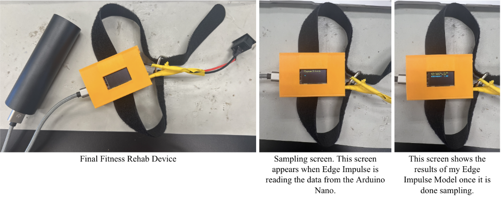
<br>
**Figure 1:** These three images show my final Fitness Rehab Device.

&emsp; &emsp; The first step to finishing my 3rd milestone was 3D printing a box that would hold my Arduino Nano, an OLED screen, and switch. **Figure 2** shows my completed box design. I used Fusion 360 in order to design my 3D printed box. An early challenge I ran into with this box design was how would the box be able to close and open so that I could have access to the components of the circuit at any time. I ultimately came to the conclusion that a sliding lid would be the best option that could securely open and close the box. This design made my box simple because the friction of the 3D printed plastic was enough to keep the sliding lid in place. This made it so that no locking mechanism would be needed. Another challenge that I faced with making my 3D box was the portable battery. This particular battery needed to power my circuit was bulky and heavy. If I were to put the portable battery into the box the box would have to be bulky and heavy. One of my classmates working on a fall detection project had worked with a similar portable charger and put it in her pocket. I took inspiration from this and designed my box in a way so that there was an extra hole in one of the sides of the box for the USB to USB-C cable to stick through. This solution meant that a small 3D printed box would be on the user’s arm, a USB to USB-C cable would run from the box to the user’s pocket, and the portable battery would be in the user’s pocket. This made the design of my box much smaller and lighter. This was important for me to do because I wanted the box to be as compact as possible so that the user could barely tell that my device was on their arm. However I also ran into other problems with my box. The 3D printed box that I created using Fusion 360 was a little tight and therefore it was hard to fit all the components of my circuit together. In order to overcome this challenge I had to file down and take out the right wall (check **Figure 2** for which face of the box this was).

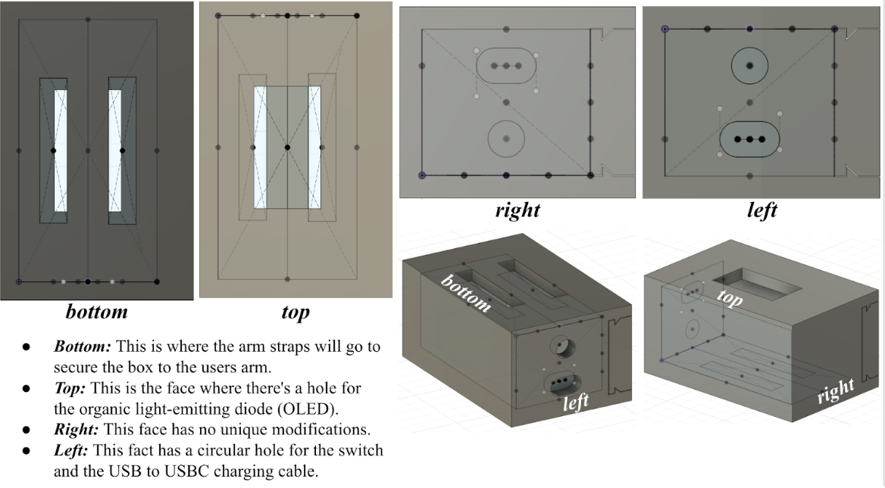
<br>
**Figure 2:** This diagram uses images that were taken from the file that I used to 3D print my box. It clearly shows where the holes in my box are and what they are going to be used for.

&emsp; &emsp; The other main element of my 3rd milestone was to get my OLED screen to show some sort of progress that the user is doing based off of my trained model on Edge Impulse. In my original project instructions, I had code that could be used to show a progress bar on the OLED based on the user's shoulder movements and a Edge Impulse model. However I ran into many problems with this code. Since someone else had written the code, I didn't have a good understanding of how the different elements of the code worked together which made it extremely difficult to debug and add any modifications. I ran into troubles such as the screen not switching to the progress bar, the display not turning on, and the progress screen not updating. Ultimately, I created my own code for my OLED screen that would show when the Edge Impulse model is sampling and the probability that the user is doing arm twists or full bow. This way I would have more control over what was happening on my OLED and freedom to design what was on the display however I wanted. The code that I used for this project is in the code section on this site.
<br>
&emsp; &emsp; One of the main problems that I faced was when I would combine my Edge Impulse code with my OLED display code. The problem I faced was that my Edge Impulse code had a while loop in the loop section of the code. This would mean that the OLED screen would run for a couple minutes but then freeze. This occurred because the Arduino would be too backed up because of all the loops. In order to overcome this problem I had to select the non continuous version of the Edge Impulse code. Not only was the Edge Impulse code for the non continuous version shorter but it didn't have a while loop and prevented the OLED screen from freezing.
<br>
&emsp; &emsp; The main element to my project is my Edge Impulse model. **Figure 3** shows how my Edge Impulse Model works. My input layer has 39 features, my first dense layer has 20 neurons, my second dense layer has 10 neurons, and my output layer has 3 classes. The input layer is where the neural network receives the data. The first and second dense layers of my neural network are responsible for the performance of my model. The output layer is where the result is found for the neural network. The output layer in my neural network has 3 output classes for arm twists, full bow, and no movement. These are the only possible results for this neural network.

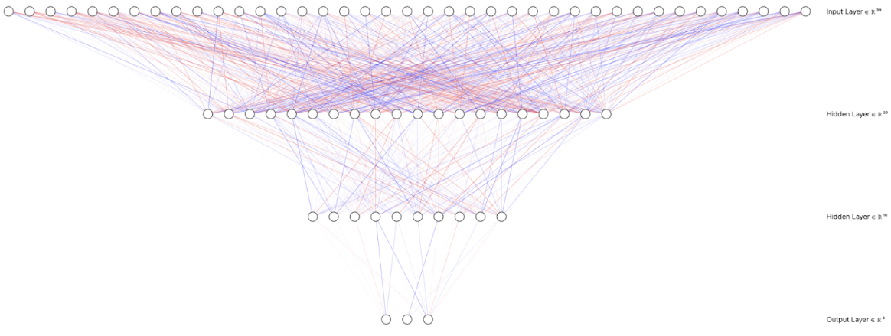
<br>
**Figure 3:** This diagram shows the fully connected neural network of my Edge Impulse model

&emsp; &emsp; **Figure 4** shows the accuracy of my model on the training data and testing data. The accuracy of my model on training data is 100.0%. This is when the model runs with data that was used to train the model. The accuracy of my model on testing data was 99.40%. This percentage shows how accurately my model was able to classify data in the correct class with data that it hasn't seen. **Figure 5** shows why having a train and test set is important. If a machine learning model has a high accuracy with the train data set and a low accuracy with the test data this means that the model is memorizing the data instead of getting trained.


<br>
**Figure 4:** This diagram shows the accuracy of my Edge Impulse Model with the training and testing data.

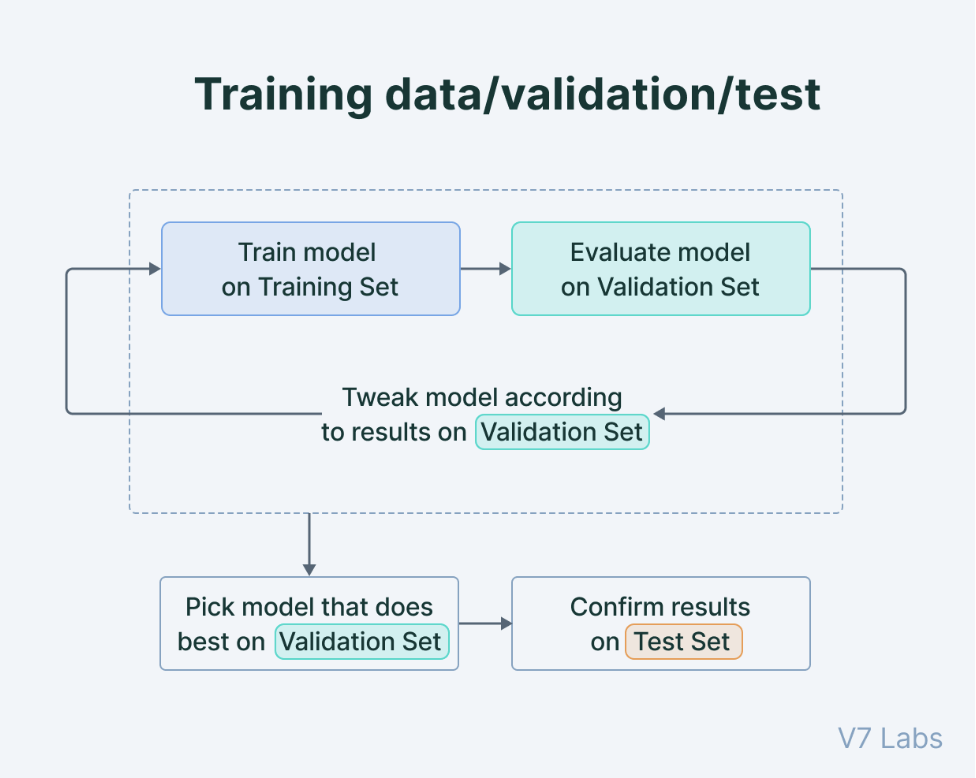
<br>
Source: <a href="https://www.v7labs.com/blog/train-validation-test-set"> Link </a> 
<br>
**Figure 5:** This diagram shows the accuracy of my Edge Impulse Model with the training and testing data.

<!--- **Don't forget to replace the text below with the embedding for your milestone video. Go to Youtube, click Share -> Embed, and copy and paste the code to replace what's below.** -->

<!---
<iframe width="560" height="315" src="https://www.youtube.com/embed/F7M7imOVGug" title="YouTube video player" frameborder="0" allow="accelerometer; autoplay; clipboard-write; encrypted-media; gyroscope; picture-in-picture; web-share" allowfullscreen></iframe> 
-->

<!--- For your final milestone, explain the outcome of your project. Key details to include are:
- What you've accomplished since your previous milestone
- What your biggest challenges and triumphs were at BSE
- A summary of key topics you learned about
- What you hope to learn in the future after everything you've learned at BSE -->


# Second Milestone

<iframe width="560" height="315" src="https://www.youtube.com/embed/JMtBTNYhmgg?si=7giFy6QlRSh-T_qE" title="YouTube video player" frameborder="0" allow="accelerometer; autoplay; clipboard-write; encrypted-media; gyroscope; picture-in-picture; web-share" referrerpolicy="strict-origin-when-cross-origin" allowfullscreen></iframe>

<br>
&emsp; &emsp; My second milestone was connecting my Arduino Nano circuit to Edge Impulse and looking at typical accelerometer values for correct shoulder movement. To do this, I had to install edge-impulse-cli and arduino-cli. A command-line interface (CLI) is how a user interacts with their computer through a terminal. This milestone also included assembling the components of my circuit (Organic Light-Emitting Diode (OLED), battery, and switch). My first milestone was learning the mechanics of how machine learning, more specifically, Edge Impulse works in order to train a model. My second milestone builds off of this by setting up the necessary connections between Edge Impulse and my Arduino Nano in order to train my final model. 
<br>
&emsp; &emsp; **Figure 1** is a schematic that illustrates how the different components of my circuit work together. 
The Arduino Nano is able to detect which movements the user is making and use a Edge Impulse model to classify the movements. My switch controls whether the OLED display is on or off. My OLED screen will project a progress bar which will get filled if the user does the correct shoulder movements. The Arduino Nano is currently connected to my computer in order to upload data to Edge Impulse. Once I have trained my model for my next milestone, my Arduino will be connected to a portable battery. My switch is connected to the 3.3 volts (V) on my Arduino and the voltage at the common collector (VCC) on the OLED. The 3.3V port will provide the electrical current needed to power the circuit. The portable battery will power the Arduino Nano. My A4 pin is connected to the Serial Data line (SDA) and my A5 pin is connected to the Serial Clock line (SCL). The SDA port receives and sends data and the SCL port transports the clock signal. The ground on the OLED screen is connected to ground on the arduino. 

<br>

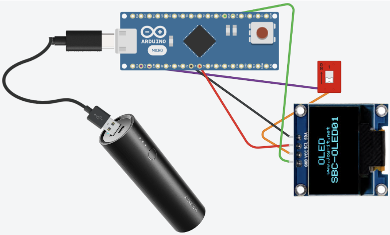
<br>
**Figure 1:** Schematic that illustrates how the different components of my circuit work together. Main components of my circuit: Arduino Nano. OLED screen, switch, and a portable charger.

<br>
&emsp; &emsp; My Arduino Nano has an accelerometer which is a sensor that tracks the acceleration and orientation of the user's arm.When acceleration and velocity are the same sign it means that the object (in this case the user’s arm) is moving faster. However, when acceleration and velocity have different signs the object is slowing down. Moreover, the Arduino Nano has a gyroscope. A gyroscope measures the orientation of the object. Gyroscopes have a spinning wheel that is able to recognize its orientation. However, my Arduino uses a micro-electromechanical system (MEMS) gyroscope. A MEMS gyroscope works the same as a regular gyroscope except it is scaled down so that it is very small. Orientation and acceleration are both measured on a xyz plane. **Figure 2** shows how the accelerometer gathers its data with respect to the xyz plane. 

<br>

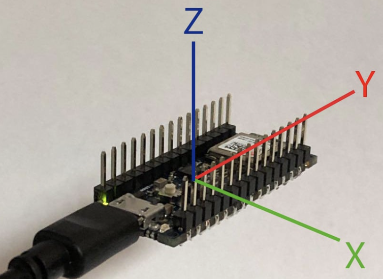
<br>
**Figure 2:** How the accelerometer measures values of acceleration and orientation on the xyz plane. Source: https://maker.pro/arduino/tutorial/how-to-use-the-arduino-nano-33-bles-built-in-imu

<br>
**Figure 3** shows typical accelerometer values for exercise #1 (arm twist exercise on Figure 4). 
<br>
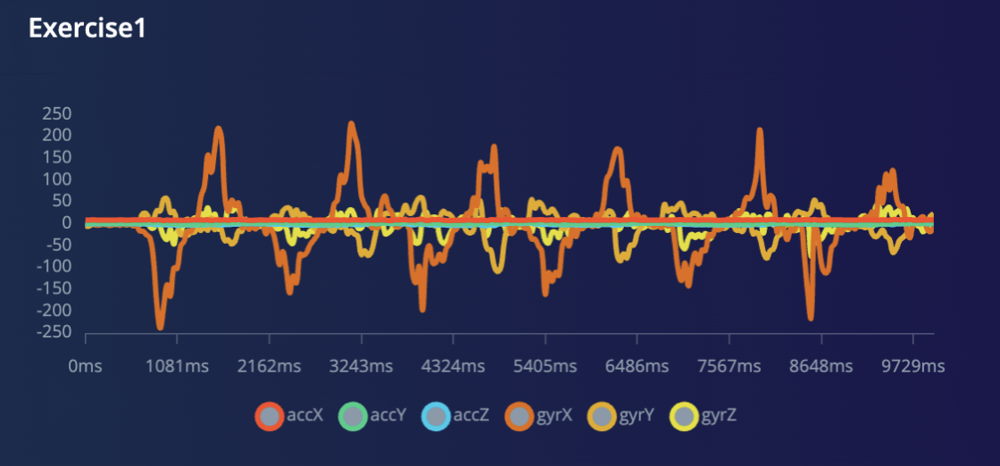
<br>
**Figure 3:** Edge Impulse graph showing typical accelerometer values for exercise #1 of rotator cuff 
recovery. Acc is the acronym for acceleration and gyr is the acronym for gyroscope. Note how the x values for the gyroscope are really high. Moreover acceleration stays constant and is close to zero.

<br>

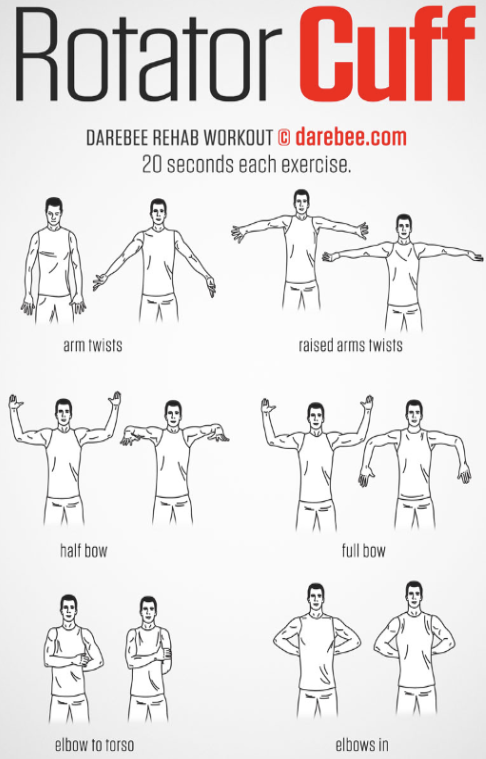
<br>
**Figure 4:** Rotator cuff recovery exercises that I will be training my Edge Impulse model on. Source: https://darebee.com/workouts/rotator-cuff-workout.html

<br>
&emsp; &emsp; Since I was constantly moving my arm when collecting this data, the acceleration of my arm stayed close to 0 because my arm wasn’t slowing or speeding up. The only values that change are the gyrX, gyrY, and gyrZ values. This is because as I move my arm the orientation changes and the gyroscope is the component that detects these changes.
<br>
&emsp; &emsp; One of the challenges that I had to overcome was connecting my Arduino Nano to Edge Impulse on my computer. After going through all the steps posted on the Edge Impulse website, I kept on getting the error that the command edge-impulse-daemon --clean was not found. The edge-impulse-daemon command is an important command because it is what connects the Arduino Nano to Edge Impulse. The solution to this problem was that I had to download chown. The chown command changes the ownership of a directory which ultimately helped solve my problem. However, when I revisited my project the next day, the same command not found error would appear when running edge-impulse-daemon --clean. Although, since chown was already installed on my computer this wasn't the problem. The solution to this problem was that I had to run the command brew update. This command updates the Homebrew package manager. Homebrew is an essential software that makes it easy to install other softwares.
<br>
&emsp; &emsp; In order to finish my project I still have to train my model, code the OLED screen to show a progress bar, and assemble all the components for my project. I am close to finishing my project and I am excited to see what the end result will look like.

<!--- **Don't forget to replace the text below with the embedding for your milestone video. Go to Youtube, click Share -> Embed, and copy and paste the code to replace what's below.** -->

<!---
<iframe width="560" height="315" src="https://www.youtube.com/embed/y3VAmNlER5Y" title="YouTube video player" frameborder="0" allow="accelerometer; autoplay; clipboard-write; encrypted-media; gyroscope; picture-in-picture; web-share" allowfullscreen></iframe>
-->

<!--- For your second milestone, explain what you've worked on since your previous milestone. You can highlight:
- Technical details of what you've accomplished and how they contribute to the final goal
- What has been surprising about the project so far
- Previous challenges you faced that you overcame
- What needs to be completed before your final milestone 

-->

# First Milestone

<iframe width="560" height="315" src="https://www.youtube.com/embed/7U8yNla3_gU?si=KJVs3y6t1QKK2BAB" title="YouTube video player" frameborder="0" allow="accelerometer; autoplay; clipboard-write; encrypted-media; gyroscope; picture-in-picture; web-share" referrerpolicy="strict-origin-when-cross-origin" allowfullscreen></iframe>

<br>
&emsp; &emsp; My main project requires using Edge Impulse to create a machine learning model. Edge Impulse is an online platform where users can create and deploy their own machine learning models. My first milestone was to get familiar with the Edge Impulse interface by completing an audio speech classifier model in order to gain a deeper understanding of how machine learning works as I will use this later. 
<br>
&emsp; &emsp; My final model had 7 classes: hello_dad, hello_frederick, hello_nella, hello_sophia, hello_mom, noise, and unknown. The model works by having the user say something into a microphone. If the user says anything, the model continuously predicts the class and accuracy. The ideal accuracy for a machine learning model is 100%. Although, since I am not able to collect every single possibility of data in my data set, a realistic accuracy for my validation set is 80%. Machine learning uses a train dataset to train the model and a validation set in order to get an unbiased assessment of the accuracy of the model. **Figure 3** shows a test deployment of my model in real time. This illustrates that my model generated the correct class that I spoke in the microphone with an accuracy between 88% and 91% across 2 timestamps.
<br>
&emsp; &emsp; One of the challenges that I had to overcome when adding new classes was data bias. I originally had only had 3 classes: hello_sophia, noise, and unknown. Before adding new classes, it would correctly identify hello_sophia. However, it would incorrectly identify the new classes as hello_sophia because that was where the most data was. I was able to overcome this problem by adding more data to the classes that lacked sufficient data. Since I can't generate a graph showing the accuracy of the training and validation datasets overtime, I can't determine if the data was underfit or overfit. However, **Figure 2** shows the confusion matrix for the validation set that Edge Impulse generates. Looking at the matrix, my model was able to identify noise correctly 97.6% of the time. However the class with the lowest percentage was “hello dad”. The model was only able to correctly identify this class only 76.8% of the time which is still fairly high. Therefore, something that I can do in order to improve my model for the future is add more data to my “hello dad” class. The confusion matrix shows that the model was able to correctly predict the individual class accurately. The highest inaccuracy in the matrix is when the model predicted hello_mom but the actual label was hello_nella. Although, the model only predicts the inaccuracy between hello_mom and hello_nella 9.3% of the time which is very low.
<br>
&emsp; &emsp; Something that I learned in this milestone was data splitting. One reason why data splitting is important is that long recordings of a class can have noise which leads to inaccurate data and low accuracy. **Figure 3** illustrates how I split the data on Edge Impulse. When I was recording the training data for my model I used recordings that were 1-3min long with me repeating the words associated with the class over and over again. This led to a low accuracy because the model wasn’t able to determine specifically when I was saying the class. In order to overcome this challenge I split my recordings. Splitting into small manageable chunks on Edge Impulse helped me organize each individual set of data so that it has a train/test split of 80/20 respectfully. 
<br>
&emsp; &emsp; In order to visualize how Edge Impulse Works, **Figure 4** is a flow chart that shows the process of how I used Edge Impulse in order to create my model.
<br>
&emsp; &emsp; Overall, through doing this tutorial I learned a lot about machine learning and how to use Edge Impulse and improve models and data. I am excited to implement what I have learned into my Fitness Rehab device.

<br>

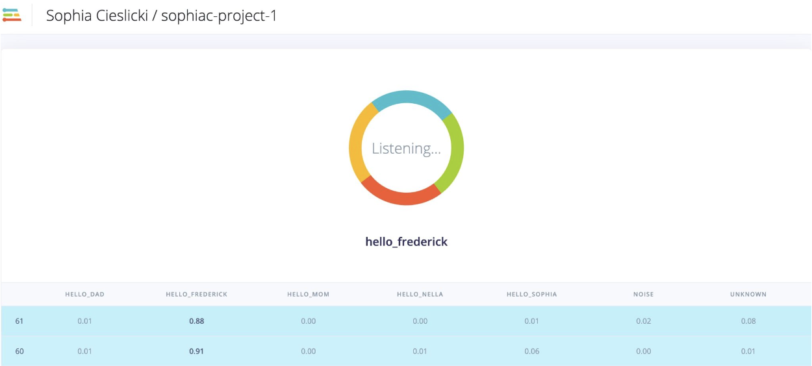
<br>
**Figure 1:** This is a live test of my machine learning model through Edge Impulse. I said “hello frederick” into the microphone of my computer and the model responded by showing the hello_frederick class and guessed this with an accuracy of 88% and 91% between timestamps.

<br>

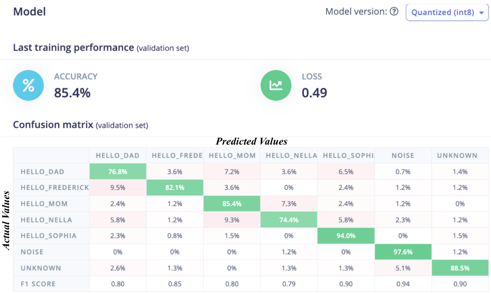
<br>
**Figure 2:** This image shows how my validation set performed through a confusion matrix. The actual values are in the column on the left and the predicted values are in the row at the top of the confusion matrix. Looking at this confusion matrix, something that I can do to improve my matrix for the future is add more data for the hello_dad label in order to increase its accuracy on the confusion matrix.

<br>

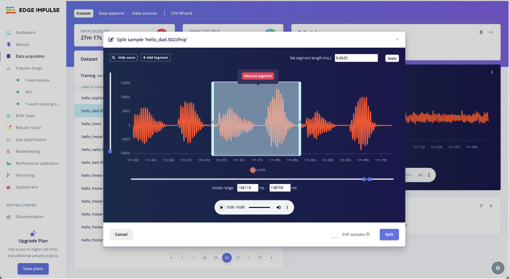
<br>
**Figure 3:** This is how I split my data recording on Edge Impulse. This recording was originally 2min. I was able to split the data by zooming in on the individual waveforms. I added segments in order for Edge Impulse to understand specifically what parts of the audio I needed to split. After splitting the recording, I was able to turn this 2min recording into 1-2 sec data sets. 

<br>

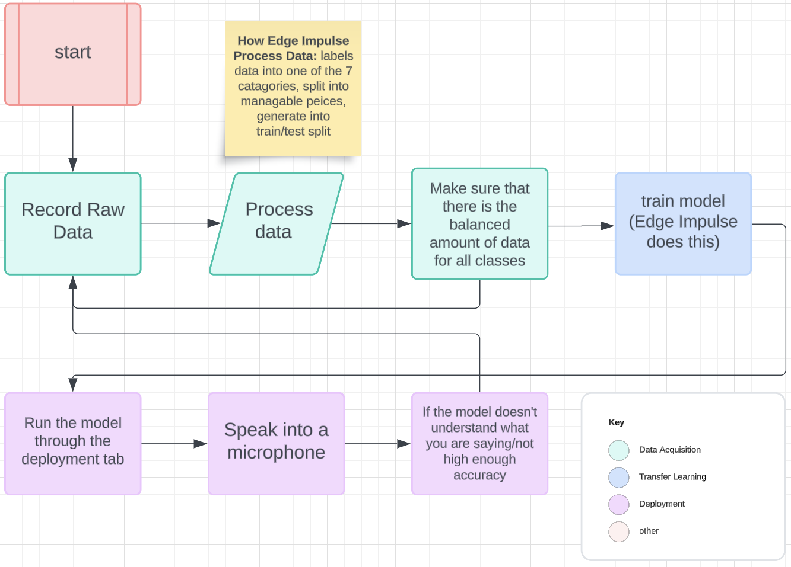
<br>
**Figure 4:** Flowchart created through Lucid Chart in order to illustrate how I used Edge Impulse to create my machine learning model. The category transfer learning is when I use a pre-existing model but train it for a new task. I used MobileNet as my pre-existing model and changed the final dense layer in order for the model to do my task.

# Schematics 
<!--- Here's where you'll put images of your schematics. [Tinkercad](https://www.tinkercad.com/blog/official-guide-to-tinkercad-circuits) and [Fritzing](https://fritzing.org/learning/) are both great resoruces to create professional schematic diagrams, though BSE recommends Tinkercad becuase it can be done easily and for free in the browser. -->

# Code
<!--- Here's where you'll put your code. The syntax below places it into a block of code. Follow the guide [here]([url](https://www.markdownguide.org/extended-syntax/)) to learn how to customize it to your project needs. -->
<!---
```c++
void setup() {
  // put your setup code here, to run once:
  Serial.begin(9600);
  Serial.println("Hello World!");
}

void loop() {
  // put your main code here, to run repeatedly:

}
```
-->
# Bill of Materials
<!--- Here's where you'll list the parts in your project. To add more rows, just copy and paste the example rows below.
Don't forget to place the link of where to buy each component inside the quotation marks in the corresponding row after href =. Follow the guide [here]([url](https://www.markdownguide.org/extended-syntax/)) to learn how to customize this to your project needs. -->

| **Part** | **Note** | **Price** | **Link** |
|:--:|:--:|:--:|:--:|
| Arduino Nano ESP32 with headers | Accelerometer that measures the orientation of the device and sends data | $21.00 | <a href="https://store.arduino.cc/products/nano-esp32-with-headers?queryID=undefined"> Link </a> |
| 5V Anker Portable Charger | Portable Charger that powers my Fitness Rehab Device | $21.99 | <a href="https://www.amazon.com/Anker-PowerCore-Ultra-Compact-High-Speed-Technology/dp/B01CU1EC6Y/ref=asc_df_B01CU1EC6Y/?tag=hyprod-20&linkCode=df0&hvadid=692875362841&hvpos=&hvnetw=g&hvrand=4773045559053724983&hvpone=&hvptwo=&hvqmt=&hvdev=c&hvdvcmdl=&hvlocint=&hvlocphy=9032171&hvtargid=pla-2281435179018&mcid=fdcb0f9cf99a38f59c978b1beff59d4f&hvocijid=4773045559053724983-B01CU1EC6Y-&hvexpln=73&gad_source=1&th=1"> Link </a> |
| USB-C to USB-A Cable | Cable that connects my Arduino to my Portable Charger | $8.99 | <a href="https://www.amazon.com/Amazon-Basics-Charger-High-Speed-Certified/dp/B07D7TXTPP/ref=sr_1_1_ffob_sspa?crid=1KVA9T6AJZ5KG&dib=eyJ2IjoiMSJ9.xpPQYmruVr47XUJUWgEDIOtuZGg-05a9clikk9FgGx6o2FzAIk0YBkRnBLT0BM_K9rhMF05w7LAwID7x-C-vlsZ87VYsP5BkhdOHsArDJTJL3XijZvqhGwl8eonzTKdQGJuQMmLdTMRq_HAza6RQ-yDE2-tgUeKERxA5PVnJSiRP_YxFPea-SJcbu6Hi2wcaRE5k68H1AOtVnK09PB-F-S7Z9f21iWTtgW-48Ais6cU.8-FDVjd9DhpSgI2rTf4W_9SSz-bQhGVkX-dRzd9Bxlg&dib_tag=se&keywords=USB%2Bto%2BUSB-C%2Bcable&qid=1721321845&sprefix=usb%2Bto%2Busb-c%2Bcab%2Caps%2C181&sr=8-1-spons&sp_csd=d2lkZ2V0TmFtZT1zcF9hdGY&th=1"> Link </a> |
| Protoboard | Allows me to solder my wires on the protoboard instead of on the Arduino. This lessens the risk of damaging my Arduino. | $3.49 | <a href="https://www.amazon.com/SchmalzTech-Protoboard-Solderable-Breadboard-ST-PROTO-1-2/dp/B0BK76L5BD/ref=sr_1_1_sspa?crid=1D0O2TCIGT7FB&dib=eyJ2IjoiMSJ9.NGWWJtHIMOYLmLLKeSt7ECQMyykwxMTgy1pEvTAEFE7P5cSNV2SfZlHKo8mR26Vg1pSFxU5nHKE-ByXMpYaGmgJ13JNRTAOrYOMbJkV_FW9FP-rRKCCfsdDboYQhC1SxVR7Ilvg-G19D2XAOdu0XfrBdbgC9BF-cyXO68fxl-aeGZQBHSmTzxR75uczDq8KzPo5PA0zhKypNprdWDrxDrHfPH0XCijtF7sc58qPHjp8.QY8cAqb0IUpb7lwMc9feCEnJBqRm6Z-ZfWXXBwZkAIc&dib_tag=se&keywords=proto+board+small&qid=1721321953&sprefix=proto+board+smal%2Caps%2C135&sr=8-1-spons&sp_csd=d2lkZ2V0TmFtZT1zcF9hdGY&psc=1"> Link </a> |
| On/Off Switch | When the switch is off the organic light-emitting diode display (OLED) is off and when the switch is turned on my device is sampling data and showing the class probabilities from my Edge Impulse Model. | $0.80 | <a href="https://www.amazon.com/DaierTek-250VAC-Rocker-KCD1-101-Plastic/dp/B07S2QJKTX/ref=sr_1_2_sspa?crid=10A07H0O2A1CR&dib=eyJ2IjoiMSJ9.P4bKcZdJRcXxuMNNnxyMRIhBh189HSMIu_3WPvrXl1_Gv3TG3eSlp6oJ-PRYRyCflTBtSlhHBgfpXmEBSDYFwQqc5yZy6P3hLilRLlRubCjYKGvtJOK4GnEv6DGMROKhDe1FlmpNqs-xt2LTt0KfTCjjDsMt1zFWjhB0lxu3YNR1LZC5L-fz3sSi1l01HOyjRr7_Zki7nlIP25UbCZ1aPCUP_bsJsk4cd2rRxYt1YOE.XaJ2WzSPT2Uk_e1PJeuIpltwV0UNgjmiYJ2QkceXyCg&dib_tag=se&keywords=switch+electronics&qid=1721322036&sprefix=switch+electronic%2Caps%2C147&sr=8-2-spons&sp_csd=d2lkZ2V0TmFtZT1zcF9hdGY&psc=1"> Link </a> |
| Female Pin headers | Component needed to connect the protoboard to the Arduino Nano | $5.99 | <a href="https://www.amazon.com/HiLetgo-Single-Female-2-54mm-Vertical/dp/B00VVI1L1W/ref=sr_1_3?dib=eyJ2IjoiMSJ9.9vMG7GqiAFYneYPy2v9wQ9cnRq2j6cZnyBJ3JK1aSJ6f3EXtzgTb3uS55H2eiLOQDQjxINypNuhgGHtmT7yBvaprJ1Pk42NkvoEt2IcAuVJgStRU5OBGRqaN3iRPes8zV9VT4R7tZwIsz6l-PjHKbif1r3qdxkEligWQb1UuSqRpApU-CRxtlG3TirWq1G0DVHTQAk4Gow2y8drpZrga5AEy-03HECe3AdoCerhAefg.76fWr7dHnKIbCN9GilJwYTUCV3ZSdCTPQhb3Zi4qlpk&dib_tag=se&keywords=female+pin+headers&qid=1721322128&sr=8-3"> Link </a> |
| Single Stranded Wire | Electrical wire that is used to connect the Arduino Nano to the OLED screen and the switch | $15.99 | <a href="https://www.amazon.com/TUOFENG-Hookup-Wires-6-Different-Colored/dp/B084DM42JS/ref=sr_1_1_sspa?crid=3LMJ5GPXR6H2E&dib=eyJ2IjoiMSJ9.ypD7TY6pAERrEczBml63TgWwCDc-Wat6obput_1fUmic0S7w-CWMUEsfcPriopGlsSBb2EoHlQs24OuwFZn_xknwXvW3dfCvkYYWIv1FdqSdjE6iZoyrECloTUwzx1dGzJZkdCxKF05q97tfIa6gU9Dc1MegeeV_2j7Pm50F8Lh-g-eSjOW0Z_AG4y3gu3LD3ThUxErCKwqedZU0owI2MOYDgEs22kWTrA5Fy3dmHF07LyZ47WkTkd6N0Czlcg-LzgNcVChAR__9cPow_DWwE5l5okA2aTb0uMaegXpK3Qo.rASuMztYNwDkBFG6-XPs8tketgWt9opCxdilmO0ICdA&dib_tag=se&keywords=single+stranded+wire&qid=1721322942&sprefix=single+stranded+wire%2Caps%2C153&sr=8-1-spons&sp_csd=d2lkZ2V0TmFtZT1zcF9hdGY&psc=1"> Link </a> |
| Electrical Tape | I used electrical tape in order to better secure soldered wire | $8.99 | <a href="https://www.amazon.com/Electrical-Tape-Black-Waterproof-PVC/dp/B0948Q9LNN/ref=sr_1_2_sspa?crid=25YRXLV2J4QFP&dib=eyJ2IjoiMSJ9.rBT3MeRJhIfxAnZjIp4HK6WLumfNrjCglG4A-9m2K3KLKCXOBC0rXtlYMaMk8mNAKoo0ZAcFRo28I9fsseVV4AEeYIEZ1zbOut_-_vJyqByEHOCj_QDZ6trZSTVaTD1GfbQ2BROCuWAA5Kc_lHbWGCdqR_6C2HZsVw_awj9CHED8_yow1CLPa84j35gDyn4OiFEpmx8MYainHKoeECN1b0LealdfzmuaosJgkgX79b0.G7CaNS6OWnhdLn2BloyQKom2sovB09udVR084YuFiRo&dib_tag=se&keywords=electrical+tape&qid=1721326874&sprefix=electrical+tap%2Caps%2C151&sr=8-2-spons&sp_csd=d2lkZ2V0TmFtZT1zcF9hdGY&psc=1"> Link </a> |

<!---
| Item Name | What the item is used for | $Price | <a href="https://www.amazon.com/Arduino-A000066-ARDUINO-UNO-R3/dp/B008GRTSV6/"> Link </a> |
| Item Name | What the item is used for | $Price | <a href="https://www.amazon.com/Arduino-A000066-ARDUINO-UNO-R3/dp/B008GRTSV6/"> Link </a> |
-->

# Starter Project - Weevil Eyes

<iframe width="560" height="315" src="https://www.youtube.com/embed/GFcvl3yDpks?si=2sdZIt-8Nk4kHONy" title="YouTube video player" frameborder="0" allow="accelerometer; autoplay; clipboard-write; encrypted-media; gyroscope; picture-in-picture; web-share" referrerpolicy="strict-origin-when-cross-origin" allowfullscreen></iframe>
<br>
&emsp; &emsp; I chose Weevil Eyes as my starter project because I wanted to gain a basic understanding of some of the fundamental electrical components used in electrical engineering. When pressing my finger on the photocell of my Weevil Eyes project, the light emitting diodes (LED’s) light up and when I remove my finger from the photocell the LED’s go dark. 
<br>
&emsp; &emsp; The components of my Weevil Eyes are a Weevil Eye Circuit Board, 2 LED’s, a 47K resistor, two 220K resistors, a Bipolar Junction Transistor (BJT), a photocell, a battery holder, and a 20mm battery. A photocell is a light sensitive resistor: as light increases, the resistance decreases and vice versa. **Figure 1** shows that the voltage of the battery (3V) remains constant and the current depends on the resistance of the photocell (R4 in **Figure 1**). Basically R4 and R3 form a voltage divider which controls the voltage of the base. **Figure 2** shows the BJT.
<br>
&emsp; &emsp; There are three BJT components: 1) collector, 2) base, and 3) emitter. The collector is connected to ground, the base is connected to the photocell, and the emitter is connected to the resistors and LEDs, all shown in **Figure 1.** The resistors restrict and regulate the electrical current. When your finger is removed from the photocell, there is resistance and the electrical current cannot pass through the collector and emitter. This means that the circuit is an open circuit and the LEDs won’t turn on.
<br>
&emsp; &emsp; I am excited to begin my Fitness Rehab Device as my main project and strengthen my electrical engineering skill set.


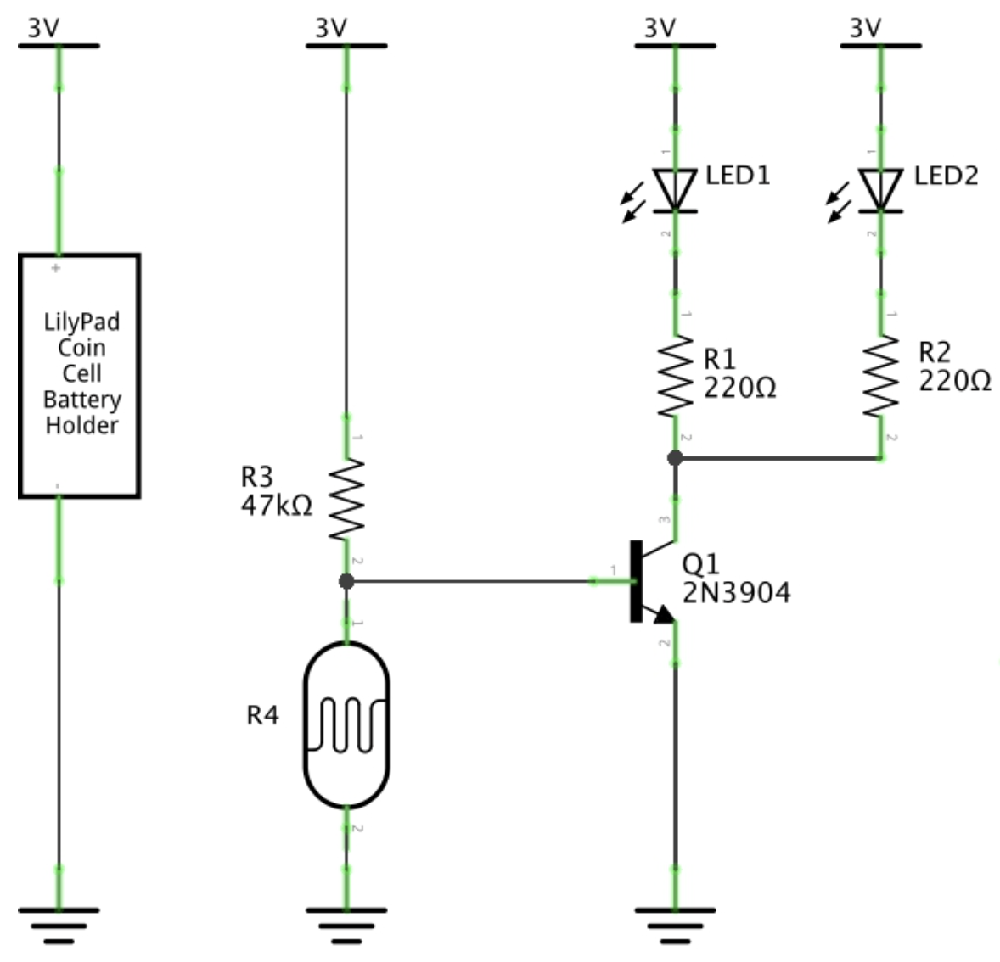
<br>
**Figure 1:** Schematic showing Weevil Eye circuit. R4 is the photocell and is the only sensor. This controls the LED lights.
Source: https://www.youtube.com/watch?v=Az2TM6Gtp0o
<br>
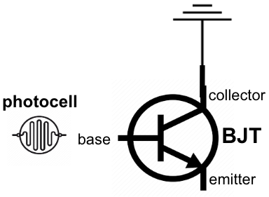
<br>
**Figure 2:** Schematic that shows how the Bipolar Junction Transistor (BJT) in my Weevil Eye project.

# Other Resources

- [MLU-EXPLAIN](https://mlu-explain.github.io/)

<!---
- [Example 2](https://sviatil0.github.io/Sviatoslav_BSE/)
- [Example 3](https://arneshkumar.github.io/arneshbluestamp/)

To watch the BSE tutorial on how to create a portfolio, click here.
-->
